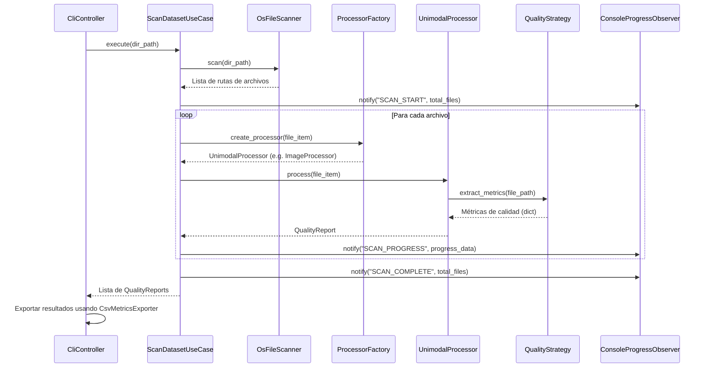

# Plan de Implementación: Analizador Unimodal de Calidad de Datos

Este documento describe el diseño y plan de implementación para un proyecto de Python que escanea un directorio de datos, clasifica los archivos según su modalidad (texto estructurado, imagen, audio), calcula métricas de calidad de datos específicas para cada modalidad, y exporta los resultados a un archivo CSV. 

El proyecto sigue los principios de **Clean Architecture** e implementa los patrones de diseño **Factory Method**, **Strategy** y **Observer**, asegurando el principio de responsabilidad única (**SRP**) y otras directrices de **SOLID**.

---

## 1. Arquitectura Propuesta (Clean Architecture)

El proyecto se dividirá en cuatro capas concéntricas con flujo de dependencia hacia el interior (el núcleo no conoce detalles externos):

### A. Capa de Dominio (Core)
*   **Responsabilidad:** Contiene las reglas del negocio puras y modelos de datos básicos. No tiene dependencias externas ni de librerías como Pandas, Pillow o Mutagen.
*   **Componentes:**
    *   `Modality` (Enum): Representa las modalidades (`STRUCTURED_TEXT`, `IMAGE`, `AUDIO`, `UNKNOWN`).
    *   `FileItem` (DataClass): Información básica del archivo (`path`, `name`, `extension`, `modality`).
    *   `QualityReport` (DataClass): Contiene el `FileItem`, diccionario de métricas extraídas, timestamp y estado del procesamiento.
    *   `Observer` y `Subject` (Interfaces/Clases Base): Implementan el patrón Observer para notificaciones del progreso de barrido de archivos.
    *   `FileScanner` (Interfaz): Contrato para el componente que explora el sistema de archivos.
    *   `QualityStrategy` (Interfaz): Contrato para las estrategias de extracción de calidad.
    *   `UnimodalProcessor` (Interfaz): Contrato para los procesadores.

### B. Capa de Casos de Uso (Application)
*   **Responsabilidad:** Orquesta el flujo de datos desde y hacia las entidades. Implementa las reglas de aplicación específicas.
*   **Componentes:**
    *   `ScanDatasetUseCase`: Coordina el escaneo de directorios, instancia procesadores usando la fábrica, calcula métricas, notifica a los observadores sobre el avance y recopila resultados.
    *   `AbstractProcessorFactory` (Interfaz): Interfaz para la fábrica de procesadores unimodales.

### C. Capa de Adaptadores (Interface Adapters)
*   **Responsabilidad:** Traduce los datos del formato más conveniente para los casos de uso al formato más conveniente para entidades externas (pantalla, archivos CSV).
*   **Componentes:**
    *   `CliController`: Controlador CLI que recibe la ruta de entrada, configura el caso de uso y coordina la ejecución.
    *   `ConsoleProgressObserver` (UI Observer): Implementación concreta de `Observer` que imprime el progreso en la terminal.
    *   `CsvMetricsExporter` (Gateway): Traduce los resultados a un DataFrame de Pandas y los exporta a un archivo CSV.

### D. Capa de Infraestructura (Frameworks and Drivers)
*   **Responsabilidad:** Herramientas y detalles del sistema operativo o librerías de terceros.
*   **Componentes:**
    *   `OsFileScanner`: Implementa la búsqueda recursiva de archivos utilizando el sistema de archivos de Python (`pathlib`).
    *   `BaseUnimodalProcessor` y `UnknownFileProcessor`: Procesadores concretos.
    *   `StructuredTextQualityStrategy`: Estrategia de métricas para CSV, TXT, XLSX (usa Pandas/Openpyxl).
    *   `ImageQualityStrategy`: Estrategia de métricas para JPG, JPEG, PNG (usa Pillow para leer dimensiones, canales, etc.).
    *   `AudioQualityStrategy`: Estrategia de métricas para MP3, WAV, MO3 (usa Mutagen/Wave para leer canales, tasa de muestreo, duración).

---

## 2. Estructura de Directorios y Archivos

```
antigravity_learning_project/
│
├── src/
│   ├── __init__.py
│   │
│   ├── domain/
│   │   ├── __init__.py
│   │   ├── entities.py         # FileItem, QualityReport, Modality
│   │   └── interfaces.py       # Interfaces: Observer, Subject, FileScanner, QualityStrategy, UnimodalProcessor, MetricsExporter
│   │
│   ├── use_cases/
│   │   ├── __init__.py
│   │   ├── scan_dataset.py     # ScanDatasetUseCase (orquestador de lógica de negocio)
│   │   └── factory.py          # AbstractProcessorFactory e implementación de ProcessorFactory
│   │
│   ├── adapters/
│   │   ├── __init__.py
│   │   ├── controllers.py      # CliController (controlador CLI)
│   │   ├── observers.py        # ConsoleProgressObserver (UI / salida consola)
│   │   └── exporters.py        # CsvMetricsExporter (transforma reportes a DataFrame y guarda a CSV)
│   │
│   ├── infrastructure/
│   │   ├── __init__.py
│   │   ├── scanner.py          # OsFileScanner (os.walk o pathlib.rglob)
│   │   └── processors/
│   │       ├── __init__.py
│   │       ├── base.py         # BaseUnimodalProcessor y UnknownFileProcessor
│   │       ├── structured_text.py # StructuredTextQualityStrategy y StructuredTextProcessor
│   │       ├── image.py        # ImageQualityStrategy e ImageProcessor
│   │       └── audio.py        # AudioQualityStrategy y AudioProcessor
│   │
│   └── main.py                 # Punto de entrada / Composition Root (inyección de dependencias)
│
├── tests/
│   ├── __init__.py
│   ├── test_use_cases.py       # Tests del caso de uso principal y flujo del observer
│   ├── test_processors.py      # Tests de la fábrica y estrategias unimodales
│   └── test_scanner.py         # Tests de la lógica del lector de archivos
│
├── requirements.txt            # Dependencias del proyecto (pandas, openpyxl, pillow, mutagen)
└── README.md                   # Documentación general
```

---

## 3. Flujo del Sistema y Patrones de Diseño



---

## 4. Plan de Verificación y Pruebas

### Pruebas Automatizadas
Desarrollaremos pruebas usando `unittest` que validen:
1.  **Scanner:** Verificar la lectura recursiva de archivos.
2.  **Factory Method:** Probar que cada extensión mapee al procesador unimodal correspondiente.
3.  **Strategies:** Simular archivos de prueba para corroborar la correcta extracción de metadatos (e.g., resolución en imágenes, filas en texto, duración en audio).
4.  **Observer:** Asegurar que el caso de uso notifique los eventos de progreso en el orden adecuado sin fallos de acoplamiento.
5.  **Exporter:** Verificar que los reportes se consoliden en un archivo CSV válido.

Comando de ejecución:
```bash
python -m unittest discover -s tests
```

### Pruebas Manuales
1.  Crear una carpeta de prueba con archivos de diferentes extensiones (`.csv`, `.xlsx`, `.png`, `.wav`, `.mp3`, `.pdf`).
2.  Correr la aplicación especificando los argumentos de entrada.
3.  Revisar que la barra de progreso o logs en consola se actualicen secuencialmente.
4.  Verificar que el archivo CSV final contenga filas estructuradas con las columnas adecuadas de métricas.
