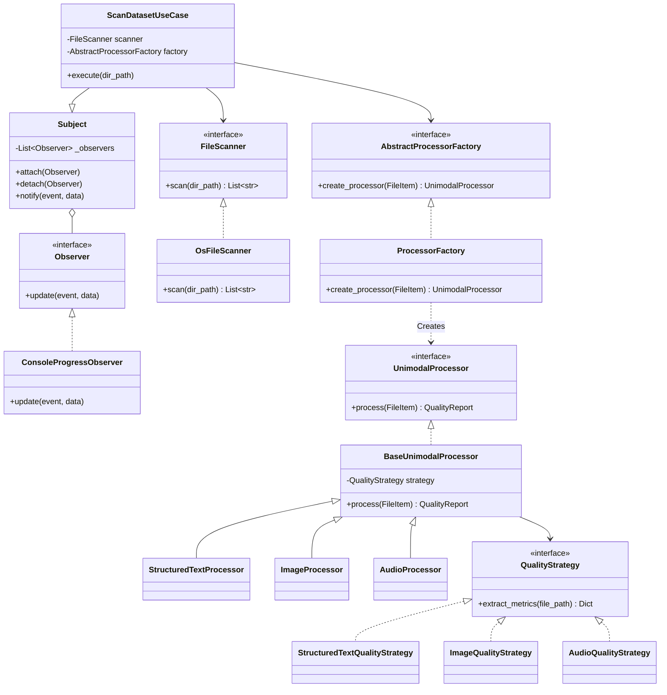

# Implementation Plan - Unimodal Data Quality Analyzer

This document describes the design and implementation plan for a Python project that scans a dataset directory, classifies files into modalities (structured text, image, audio), computes modality-specific data quality metrics, and exports them to a CSV file. The project follows **Clean Architecture** principles and implements design patterns (**Factory Method**, **Strategy**, **Observer**), ensuring the **Single Responsibility Principle (SRP)** and other **SOLID** guidelines.

## User Review Required

> [!NOTE]
> We will use **Pandas**, **Pillow (PIL)**, and **mutagen** to extract rich metadata metrics.
> Let's configure the supported extensions as:
> - **Structured Text**: `.csv`, `.txt`, `.xlsx`
> - **Images**: `.jpg`, `.jpeg`, `.png`
> - **Audio**: `.mp3`, `.wav`, `.mo3` (as requested)
> Please confirm if you have specific preferences for additional library dependencies or python versions.

## Proposed System Architecture

### Clean Architecture Layers

1. **Domain Layer (Core Business Logic)**
   - Contains pure business logic and entity models (`FileItem`, `QualityReport`, etc.).
   - Defines interfaces/contracts (`FileScanner`, `QualityStrategy`, `UnimodalProcessor`, `Observer`, `Subject`).
   - Has zero dependencies on external frameworks, UI, or library-specific details (e.g., no Pandas or Pillow imports here).

2. **Use Cases Layer (Application Logic)**
   - Implements application business rules.
   - Contains `ScanDatasetUseCase`, which coordinates scanning, processor creation, metric processing, and progress notification.
   - Contains factory abstractions for processor creation.

3. **Interface Adapters Layer (Gateways, Controllers, Presenters)**
   - Adapts data from/to the use case.
   - **Controllers**: CLI controller that accepts inputs and triggers execution.
   - **Presenters / Observers**: Console progress observers that output to stdout/UI.
   - **Exporters**: Converts reports to DataFrame and exports to CSV.

4. **Infrastructure Layer (Frameworks and Drivers)**
   - External library implementations.
   - OS-level directory scanning (`OsFileScanner`).
   - Concrete implementations of unimodal processors and strategies (e.g. `Pandas`/`Openpyxl` for text, `Pillow` for images, `Wave`/`Mutagen` for audio).

---

### Key Design Patterns



1. **Factory Method Pattern**:
   - `ProcessorFactory` decides which subclass of `UnimodalProcessor` to instantiate based on the extension of the `FileItem`.
2. **Strategy Pattern**:
   - Each modality (`StructuredTextProcessor`, `ImageProcessor`, `AudioProcessor`) has a corresponding `QualityStrategy` injected into it to compute quality metrics specific to the media type.
3. **Observer Pattern**:
   - `ScanDatasetUseCase` inherits from `Subject`.
   - UI adapters like `ConsoleProgressObserver` implement `Observer` and are registered to get notifications during execution (progress updates, files processed, time elapsed) without coupling the core logic to any display mechanism.

---

## Directory and File Structure

Below is the directory structure we will create under `c:\Users\USER\Documents\projects\learning\antigravity_learning_project`:

```
antigravity_learning_project/
│
├── src/
│   ├── __init__.py
│   │
│   ├── domain/
│   │   ├── __init__.py
│   │   ├── entities.py         # FileItem, QualityReport, Modality, QualityMetric
│   │   └── interfaces.py       # Base classes: Observer, Subject, FileScanner, QualityStrategy, UnimodalProcessor, MetricsExporter
│   │
│   ├── use_cases/
│   │   ├── __init__.py
│   │   ├── scan_dataset.py     # ScanDatasetUseCase (orchestrates business logic)
│   │   └── factory.py          # AbstractProcessorFactory interface and mapping logic
│   │
│   ├── adapters/
│   │   ├── __init__.py
│   │   ├── controllers.py      # CliController (handles CLI input & run)
│   │   ├── observers.py        # ConsoleProgressObserver (UI representation)
│   │   └── exporters.py        # CsvMetricsExporter (converts to pandas DataFrame & exports CSV)
│   │
│   ├── infrastructure/
│   │   ├── __init__.py
│   │   ├── scanner.py          # OsFileScanner (os.walk implementation)
│   │   └── processors/
│   │       ├── __init__.py
│   │       ├── base.py         # BaseUnimodalProcessor & UnknownFileProcessor
│   │       ├── structured_text.py # StructuredTextProcessor, StructuredTextQualityStrategy
│   │       ├── image.py        # ImageProcessor, ImageQualityStrategy
│   │       └── audio.py        # AudioProcessor, AudioQualityStrategy
│   │
│   └── main.py                 # Composition root (bootstraps and executes the application)
│
├── tests/
│   ├── __init__.py
│   ├── test_use_cases.py       # Tests scan use case logic and observer flow
│   ├── test_processors.py      # Tests factory method and strategy behaviors
│   └── test_scanner.py         # Tests file scanner integration
│
├── requirements.txt            # Project dependencies (pandas, openpyxl, pillow, mutagen)
└── README.md                   # Technical documentation
```

---

## Proposed Changes

### Component 1: Domain
Domain logic representing simple types, objects, and interfaces.
- **NEW** [entities.py](file:///c:/Users/USER/Documents/projects/learning/antigravity_learning_project/src/domain/entities.py) - Contains domain classes: `Modality` (enum), `FileItem` (dataclass), `QualityReport` (dataclass).
- **NEW** [interfaces.py](file:///c:/Users/USER/Documents/projects/learning/antigravity_learning_project/src/domain/interfaces.py) - Defines abstract base classes for `Observer`, `Subject`, `FileScanner`, `QualityStrategy`, `UnimodalProcessor`, and `MetricsExporter`.

### Component 2: Use Cases
Orchestrates domain interfaces and entity logic.
- **NEW** [scan_dataset.py](file:///c:/Users/USER/Documents/projects/learning/antigravity_learning_project/src/use_cases/scan_dataset.py) - Contains `ScanDatasetUseCase` which inherits from `Subject` and triggers scanning, notifies progress, runs the unimodal processors, and compiles results.
- **NEW** [factory.py](file:///c:/Users/USER/Documents/projects/learning/antigravity_learning_project/src/use_cases/factory.py) - Defines `AbstractProcessorFactory` interface.

### Component 3: Adapters
Interfaces to/from external tools, CLI, format exporters.
- **NEW** [controllers.py](file:///c:/Users/USER/Documents/projects/learning/antigravity_learning_project/src/adapters/controllers.py) - Contains CLI controllers to validate input path, setup use case, and run the pipeline.
- **NEW** [observers.py](file:///c:/Users/USER/Documents/projects/learning/antigravity_learning_project/src/adapters/observers.py) - Contains `ConsoleProgressObserver` implementing `Observer` for rendering CLI progress.
- **NEW** [exporters.py](file:///c:/Users/USER/Documents/projects/learning/antigravity_learning_project/src/adapters/exporters.py) - Contains `CsvMetricsExporter` which leverages Pandas to flatten quality metrics and output a CSV file.

### Component 4: Infrastructure
Concrete implementation details of scanning, processors, and strategies.
- **NEW** [scanner.py](file:///c:/Users/USER/Documents/projects/learning/antigravity_learning_project/src/infrastructure/scanner.py) - Implements directory traversing using `pathlib` or `os.walk`.
- **NEW** [base.py](file:///c:/Users/USER/Documents/projects/learning/antigravity_learning_project/src/infrastructure/processors/base.py) - Base processor classes.
- **NEW** [structured_text.py](file:///c:/Users/USER/Documents/projects/learning/antigravity_learning_project/src/infrastructure/processors/structured_text.py) - Text strategies using standard library / openpyxl / pandas.
- **NEW** [image.py](file:///c:/Users/USER/Documents/projects/learning/antigravity_learning_project/src/infrastructure/processors/image.py) - Image strategy utilizing Pillow.
- **NEW** [audio.py](file:///c:/Users/USER/Documents/projects/learning/antigravity_learning_project/src/infrastructure/processors/audio.py) - Audio strategy utilizing Python standard wave library and mutagen (for MP3).

### Component 5: Entrypoint & Settings
Wiring files.
- **NEW** [main.py](file:///c:/Users/USER/Documents/projects/learning/antigravity_learning_project/src/main.py) - Entry point. Sets up the dependency injection container and runs CLI controller.
- **NEW** [requirements.txt](file:///c:/Users/USER/Documents/projects/learning/antigravity_learning_project/requirements.txt) - Dependencies definition.

---

## Verification Plan

### Automated Tests
We will write unit tests using the standard library `unittest` framework to verify:
1. File Scanner: Correctly recursively lists files inside a mock directory.
2. Modality Factory: Instantiates correct processor subclasses according to file extension.
3. Processors & Strategies: Computes expected quality metrics for sample files (mocked or small test assets).
4. Observer Notification: Asserts that use case triggers notifications on start, progress, and finish steps.
5. Export: Verifies CSV file generation.

We will run:
```bash
python -m unittest discover -s tests
```

### Manual Verification
1. We will create a small directory structure with dummy files of each modality (e.g. `dataset/file1.csv`, `dataset/sub/file2.png`, `dataset/file3.wav`, `dataset/unsupported.pdf`).
2. Run `python src/main.py --path dataset/ --output results.csv`
3. Verify stdout updates in real time displaying observer notifications.
4. Open the generated `results.csv` and ensure quality metrics are populated and formatted.
